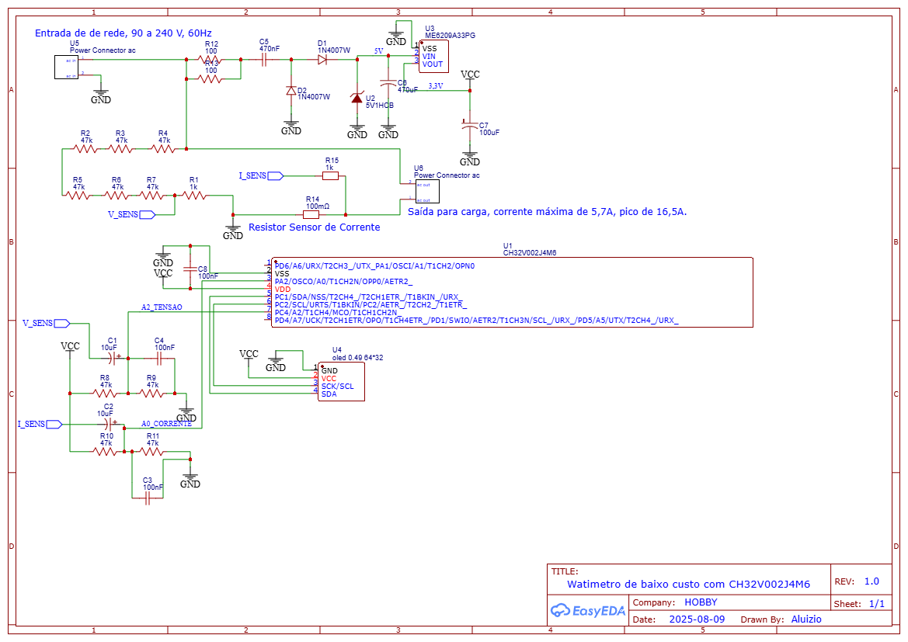
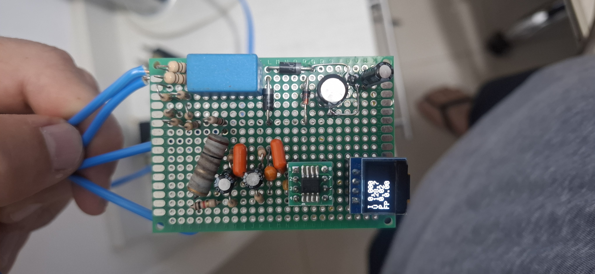
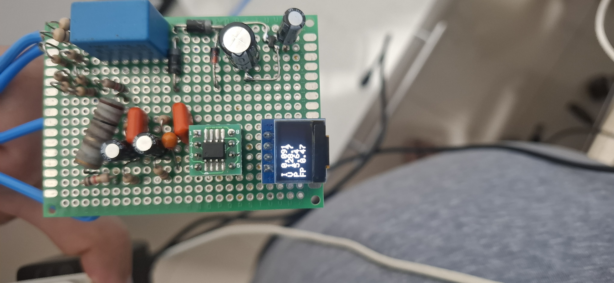

# Wattímetro com componentes de baixo custo para pequenas cargas
Sistema para medição potência em corrente alternada, monofásico, desenvolvido com componentes de baixo custo. O sistema é baseado no microcontrolador RISC-V [CH32V002J4M6](https://www.wch-ic.com/downloads/CH32V002DS0_PDF.html) para processamento da estimativa de potência ativa, fator de potência, tensão e correntes RMS.

O firmware foi elaborado com base nos application notes: [AN3322](https://www.google.com/url?sa=t&source=web&rct=j&opi=89978449&url=https://www.st.com/resource/en/application_note/an3322-watthour-meter-based-on-the-stm32f101-microcontroller-stmicroelectronics.pdf&ved=2ahUKEwjawo3q74KPAxVjK7kGHVt7MlMQFnoECBgQAQ&usg=AOvVaw3_c6WRbe4-d4W7foZ74pQP) da ST e [SLAA494B](https://www.ti.com/lit/pdf/SLAA494) da Texas Instruments. 
Para amostragem do sinais, foi utilizado conversor ADC de 12 bits e frequência de amostragem 6000Hz, os componentes externos foram dimensionados para uma banda passante de 0,7 a 1600Hz. As estimativas são efetuadas com janelas 1 s (6000 pontos) de sinal.

Para programação e criação do firmware foi utilizado a IDE [Mounriver Studio](https://www.mounriver.com/) disponibiliozada pelo fabricante [WCH](https://www.wch-ic.com/). O firmware efetua as rotínas de cálculos e exibe os valores em display oled de 0.49' (64 X 32) monocromático como comunicação I2C. Para debugger, os valores calculados são enviados por serial, via pino PA1/TX_, pino 1 do microcontrolador, em 115200 bps.

## Esquema elétrico
Esquema foi desenvolvido com componentes de baixo custo para atender cargas de 5,7A RMS com 16,5A de pico, com tensão de alimentação de 90 a 240 Vrms.  Projeto usa fonte não isolada do tipo capacitiva e a tensão de alimentação é utilizada como referência para cálculo dos valores RMS. Como sensor de corrente é ulizado resistor shunt de 0,1ohm.

## Protótipo 
O protótipo foi montado em placa universal para testes iniciais.

<!--  -->
